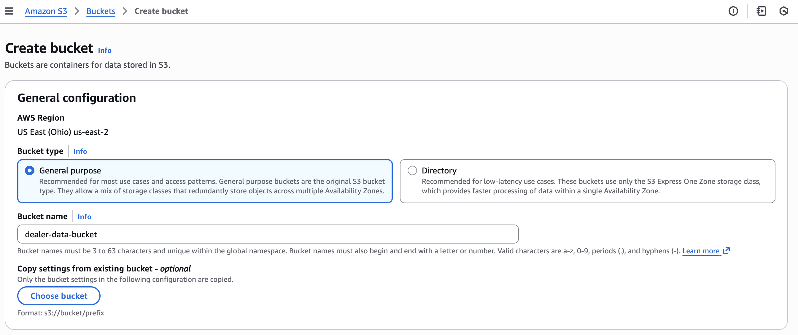
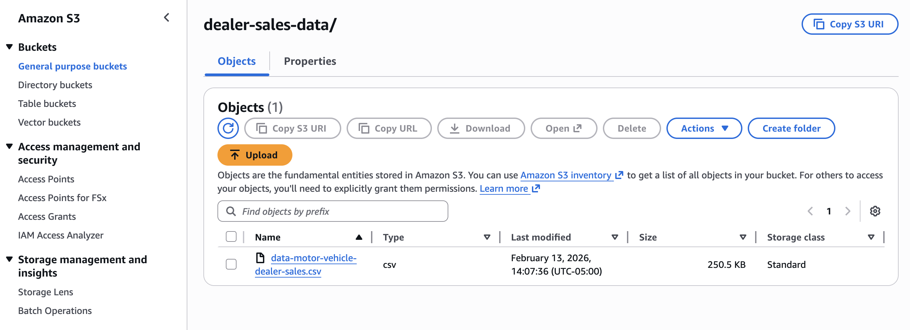

# Full AWS ETL pipeline and analysis/visualizations setup

*These steps assume an AWS account already exists and has access to all the required services. All steps are based on the current versions of the AWS services in February 2026.*

## 1. Extract: Upload CSV to S3

### Step 1: Create S3 bucket (if one does not already exist in the AWS account)

- Selections to choose when creating bucket that can perform the functions needed for this project:
    - `General Configuration`:
        - AWS Region = whichever one works best for the user
        - Bucket type = General purpose
        - Bucket name = anything unique that relates to the project
    - `Object Ownership`: ACLs disabled
    - `Block Public Access settings for this bucket`: Block all public access and all its subselections checked off
    - `Bucket Versioning`: Disable
    - `Tags`: None needed
    - `Default Encryption`:
        - Encryption type = Server-side encryption with Amazon S3 managed keys (SSE-S3)
        - Bucket Key = Enable
    - `Advanced Settings`:
        - Object Lock = Disable

### Step 2: Upload CSV file into S3 bucket

- Two options to complete this:
    - Run script in this repository: `python extract/upload_csv_to_s3.py`
    OR
    - Upload it manually to the bucket and whatever subdirectories

*Either option should work, the first one requires extra setup to connect the AWS account and S3 bucket to this project.*

## 2. Transform: Glue PySpark job

## 3. Load: Glue PySpark job (continued)

## 4. Analyze: Athena table and SQL

## 5. Visualize: QuickSight

